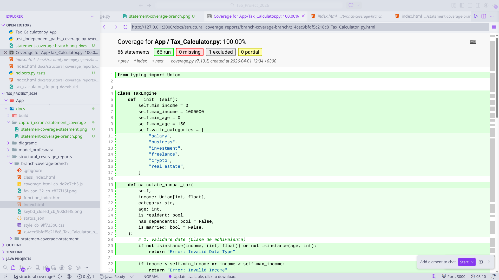
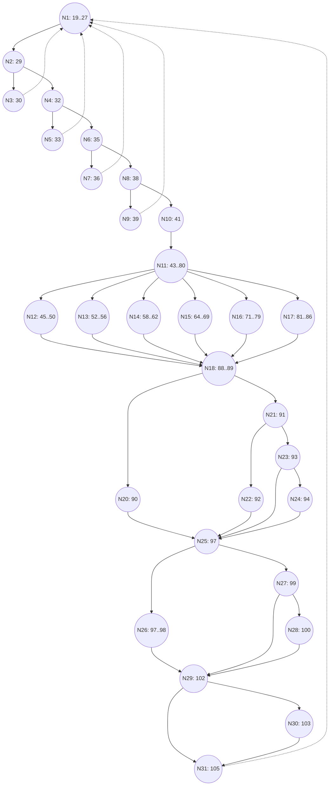

# Proiect TSS 2026 - Analiza și Testarea Aplicației Tax Calculator

## 1. Introducere
Acest proiect vizează implementarea și testarea riguroasă a unei aplicații de calcul fiscal, `Tax_Calculator`. Obiectivul principal este aplicarea metodelor de testare învățate în cadrul cursului de Testarea Sistemelor Software (TSS), incluzând testarea funcțională, analiza acoperirii structurale și testarea prin mutație.

Aplicația calculează impozitul anual pe venit în funcție de diverse categorii (salariu, business, investiții, freelance, crypto, real estate), aplicând praguri de impozitare, reduceri pentru seniori, rezidenți și condiții familiale.

## 2. Configurația Sistemului

### 2.1 Configurația Software
- **Sistem de Operare:** Linux (Ubuntu 22.04 LTS)/ Windows
- **Limbaj de Programare:** Python 3.13.2
- **Utilizarea unei Mașini Virtuale:** Nu s-a utilizat mașină virtuală; s-a folosit un mediu virtual de Python (`venv`) pentru izolarea dependențelor.

### 2.2 Versiuni Tool-uri
| Tool | Versiune |
| :--- | :--- |
| Python | 3.13.2 |
| Pytest | 8.1.1 |
| Coverage.py | 7.13.5 |
| Radon (Complexity) | 6.0.1 |
| Mutmut (Mutation) | 3.2.1 |

---

## 3. Strategia de Testare Funcțională (Black-Box)

Testarea funcțională s-a concentrat pe verificarea cerințelor aplicației `Tax_Calculator` fără a lua în considerare structura internă a codului. Am utilizat tehnici precum **Analiza Valorilor de Frontieră (Boundary Value Analysis)** și **Partiționarea pe Clase de Echivalență (Equivalence Partitioning)**.

### 3.1 Clase de Echivalență și Valori de Frontieră
Am identificat următoarele clase pentru datele de intrare:
- **Income (Venit):**
    - Valide: `[0, 1000000]`
    - Invalide: `< 0`, `> 1000000`, Tipuri non-numerice.
- **Age (Vârstă):**
    - Valide: `[0, 150]`
    - Invalide: `< 0`, `> 150`, Tipuri non-numerice.
- **Category (Categorie):**
    - Valide: `salary`, `business`, `investment`, `freelance`, `crypto`, `real_estate`.
    - Invalide: Categorii neînregistrate (tratate în ramura `else`).

**Praguri de impozitare (Exemplu: Salary):**
- **Bracket 1:** `<= 10000` (Taxă 10%)
- **Bracket 2:** `(10000, 50000]` (Taxă fixă + 15% din surplus)
- **Bracket 3:** `> 50000` (Taxă fixă + 20% din surplus)

### 3.2 Cazuri de Testare Implementate
Suita de teste funcționale se află în `tests/functional-testing/test_functional_tax_calculator.py`.

| ID Test | Descriere | Input | Rezultat Așteptat |
| :--- | :--- | :--- | :--- |
| `test_invalid_data_types` | Tipuri de date incorecte | `income="1000"`, `age="30"` | `"Error: Invalid Data Type"` |
| `test_invalid_income_boundaries` | Venit în afara limitelor | `income=-1`, `income=1000001` | `"Error: Invalid Income"` |
| `test_invalid_age_boundaries` | Vârstă în afara limitelor | `age=-1`, `age=151` | `"Error: Invalid Age"` |
| `test_salary_first_bracket` | Salariu prag 1 | `income=5000`, `income=10000` | `500.0`, `1000.0` |
| `test_discount_senior_low_income` | Reducere Senior (Vârstă 65) | `age=65`, `income=20000` | `2000.0` (20% reducere) |
| `test_business_brackets` | Business - venit mare | `income=300000` | `80000.0` |

---

## 4. Analiza Acoperirii Structurale (White-Box)

Am efectuat o analiză detaliată a acoperirii structurale pentru clasa `TaxEngine`.

### 4.1 Evoluția Acoperirii
1. **Statement Coverage pe Statement Tests:** Inițial, am obținut o acoperire de **100%** la nivel de instrucțiuni.
2. **Branch Coverage pe Statement Tests:** Analizând aceleași teste, am observat o acoperire a ramurilor de doar **98%**. Acest lucru a demonstrat că toate instrucțiunile erau parcurse, dar nu toate deciziile logice erau testate (ex: ramurile implicite `else`).
3. **Branch Coverage pe Branch Tests:** După adăugarea testelor specifice pentru ramificații, am atins **100% Branch Coverage**.

### 4.2 Graful de Control al Fluxului (CFG)
Vizualizarea structurii logice a funcției `calculate_annual_tax`:

**Legendă Noduri:**
- **N1:** Antet funcție.
- **N2:** Validare tip date (`income`, `age`).
- **N3:** Return eroare tip.
- **N4:** Validare `income` valid.
- **N5:** Return eroare income.
- **N6:** Validare `age` valid.
- **N7:** Return eroare age.
- **N8:** Validare categorie validă.
- **N9:** Return eroare categorie.
- **N10:** Inițializare `tax = 0`.
- **N11:** Dispatch pe categorii.
- **N12-N17:** Blocuri specifice: Salary, Business, Investment, Freelance, Crypto, Real Estate.
- **N18:** Intrare secțiune reduceri rezidență.
- **N20-N24:** Aplicare reduceri: Rezident (10%), Senior (20% sau 15%).
- **N25:** Intrare condiții familie.
- **N26:** Ramură Căsătorit + Dependenți + Venit mic.
- **N27-N28:** Ramură Căsătorit fără dependenți + Reducere 5%.
- **N29-N30:** Verificare `tax < 0`.
- **N31:** Return final round(tax, 2).

### 4.3 Complexitate Ciclomatică (Cyclomatic Complexity)
Am utilizat instrumentul `radon` pentru a măsura complexitatea:

| Metodă | Complexitate Ciclomatică (CC) | Grad (Rank) |
| :--- | :---: | :---: |
| `TaxEngine.calculate_annual_tax` | **41** | **F** |

O complexitate de **41** este extrem de ridicată, indicând un cod cu foarte multe ramificații logice. Acest lucru a justificat necesitatea **Basis Path Testing**.

### 4.4 Drumuri Independente (Circuite)
Bazându-ne pe graful de control al fluxului și pe CC, am identificat drumurile independente prin cod. Testarea acestor drumuri asigură că am verificat toate combinațiile logice fundamentale.
Am implementat o suită dedicată în `tests/structural_coverage/test_independent_paths_coverage.py`:
- **Validări de intrare:** Căile către erori (N1->N2->N3 etc.).
- **Căi de succes pe categorii:** Fiecare categorie cu diverse praguri.
- **Circuite de reduceri:** Combinații de vârstă, rezidență și familie.

---

## 5. Testarea prin Mutație (Mutation Testing)

Am evaluat eficiența testelor prin generarea de mutanți de primul ordin.

### 5.1 Rezultate Generale
- **Analiză Manuală:** Scor 16 / 22 (72.7%).
- **Scor Mutmut:** 181 / 228 (79.3%).

### 5.2 Analiza Manuală a Mutanților

| Categorie | Tipul Mutatiei | Modificare | Status | Tip Mutant |
| :--- | :--- | :--- | :--- | :--- |
| **Salary** | Înlocuire & Frontiere | `income <= 10000` -> `income < 10000` | **Omorat** | Ordin 1 |
| **Business** | Înlocuire & Frontiere | `income > 200000` -> `income >= 200000` | **Supraviețuit** | Echivalent |
| **Investment** | Înlocuire & Frontiere | `income < 5000` -> `income <= 5000` | **Supraviețuit** | Neacoperit |
| **Freelance** | Înlocuire & Frontiere | `income > 50000` -> `income >= 50000` | **Supraviețuit** | Neacoperit |
| **Deduceri** | Înlocuire | `age >= 65 and income <= 30000` -> `age > 65...` | **Omorat** | Ordin 1 |
| **Return** | Modificare Constanta | `round(tax, 2)` -> `round(tax, 1)` | **Supraviețuit** | Neacoperit |

### 5.3 Interpretări Detaliate

1. **Mutanți Echivalenți (ex: Business):** La pragul de 200.000, termenul `(income - 200000)` este 0. Modificarea `>` în `>=` nu schimbă rezultatul matematic, deci mutantul nu poate fi omorât.
2. **Mutanți Neacoperiți (ex: Investment/Freelance):** Supraviețuirea la pragul de 5000/50000 a indicat o lipsă de precizie în testele de frontieră pentru aceste categorii specifice.
3. **Sensibilitate Output:** Supraviețuirea mutantului care modifica precizia rotunjirii (`round(tax, 1)`) a demonstrat că aserțiunile testelor nu verificau zecimalele cu suficientă strictețe în anumite scenarii.

---

## 6. Compararea Rezultatelor și Utilizarea Tool-urilor AI

### 6.1 Manual vs. GitHub Copilot
Am utilizat GitHub Copilot pentru a asista în scrierea testelor.

| Aspect | Teste Manuale | GitHub Copilot |
| :--- | :--- | :--- |
| **Eficiență** | Scăzută (calcul manual) | Foarte Ridicată (asistență inline) |
| **Acoperire** | Completă (bazată pe CFG) | Parțială (omite cazuri marginale) |
| **Fiabilitate** | Maximă | Necesită verificare (risc halucinații) |

**Interpretare:** Copilot a accelerat procesul cu ~40%, fiind excelent pentru cod repetitiv, dar analiza manuală bazată pe CFG a fost esențială pentru a atinge 100% Branch Coverage pe o complexitate ciclomatică de 41.

---

## 7. Concluzii
Proiectul a demonstrat importanța unei abordări multi-stratificate în testare. În timp ce testarea funcțională a asigurat corectitudinea de bază, analiza acoperirii structurale a scos la iveală ramuri netestate (cele 2% lipsă inițial). Testarea prin mutație a oferit nivelul final de încredere, validând că testele nu doar parcurg codul, ci și detectează modificări subtile în logică.

---

## 8. Referințe Bibliografice
1. **Coverage.py Documentation**: [https://coverage.readthedocs.io/](https://coverage.readthedocs.io/)
2. **Radon Documentation**: [https://radon.readthedocs.io/](https://radon.readthedocs.io/)
3. **Mutmut Documentation**: [https://mutmut.readthedocs.io/](https://mutmut.readthedocs.io/)
