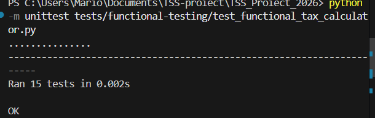

# Analiza Testării Funcționale (Functional Testing Analysis)

Testarea funcțională s-a concentrat pe verificarea cerințelor aplicației `Tax_Calculator` fără a lua în considerare structura internă a codului. Am utilizat tehnici precum **Analiza Valorilor de Frontieră (Boundary Value Analysis)** și **Partiționarea pe Clase de Echivalență (Equivalence Partitioning)**.

## 1. Clase de Echivalență și Valori de Frontieră

### Validări de intrare
Am identificat următoarele clase pentru datele de intrare:
- **Income (Venit):**
    - Valide: `[0, 1000000]`
    - Invalide: `< 0`, `> 1000000`, Tipuri non-numerice.
- **Age (Vârstă):**
    - Valide: `[0, 150]`
    - Invalide: `< 0`, `> 150`, Tipuri non-numerice.
- **Category (Categorie):**
    - Valide: `salary`, `business`, `investment`, `freelance`, `crypto`, `real_estate` (și orice alt string valid).
    - Invalide: Categorii care nu sunt permise de aplicație (deși codul tratează orice categorie necunoscută în ramura `else`).

### Praguri de impozitare (Exemplu: Salary)
- **Bracket 1:** `<= 10000` (Taxă 10%)
- **Bracket 2:** `(10000, 50000]` (Taxă fixă + 15% din ce depășește 10000)
- **Bracket 3:** `> 50000` (Taxă fixă + 20% din ce depășește 50000)

## 2. Cazuri de Testare Implementate

Suita de teste funcționale se află în `tests/functional-testing/test_functional_tax_calculator.py` și include:

| ID Test | Descriere | Input | Rezultat Așteptat |
| :--- | :--- | :--- | :--- |
| `test_invalid_data_types` | Tipuri de date incorecte | `income="1000"`, `age="30"` | `"Error: Invalid Data Type"` |
| `test_invalid_income_boundaries` | Venit în afara limitelor | `income=-1`, `income=1000001` | `"Error: Invalid Income"` |
| `test_invalid_age_boundaries` | Vârstă în afara limitelor | `age=-1`, `age=151` | `"Error: Invalid Age"` |
| `test_salary_first_bracket` | Salariu prag 1 | `income=5000`, `income=10000` | `500.0`, `1000.0` |
| `test_discount_senior_low_income` | Reducere Senior (Vârstă 65) | `age=65`, `income=20000` | `2000.0` (20% reducere) |
| `test_business_brackets` | Business - venit mare | `income=300000` | `80000.0` |

## 3. Rezultatele Rulării Testelor

Rularea testelor funcționale a confirmat că aplicația respectă specificațiile pentru cazurile nominale și pentru gestionarea erorilor de bază.

## 4. Concluzii
Suita de teste funcționale oferă o bază solidă pentru validarea corectitudinii calculelor fiscale. Deși acoperă majoritatea scenariilor de business, analiza ulterioară a acoperirii structurale și a mutanților a evidențiat necesitatea unor teste suplimentare pentru ramuri logice complexe și cazuri marginale.
