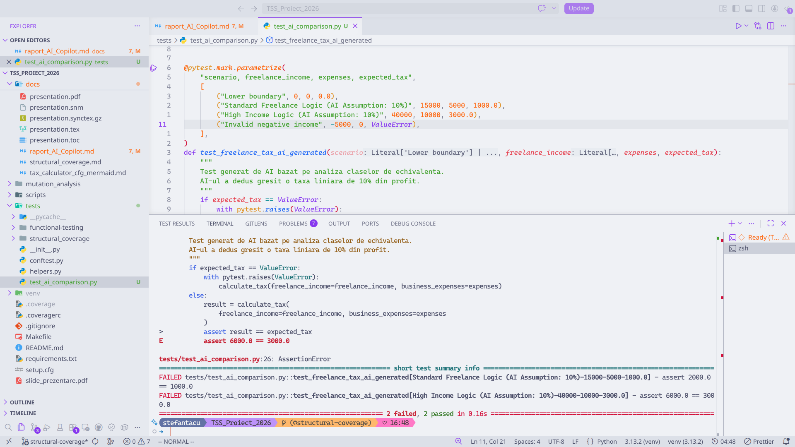

# 📊 Raport: Analiza Comparativă a Testelor Software
## AI-Generated vs. Manual Testing

**Context:** Testarea automată a aplicației `Tax_Calculator`  
**Instrumente AI:** GitHub Copilot / ChatGPT (GPT-4)  
**Data:** Februarie 2024

---

### 1. Introducere 🚀

Adoptarea **Asistenților de Cod (AI)** în ingineria software a transformat radical modul în care dezvoltăm și testăm aplicațiile [1]. Instrumente precum GitHub Copilot sunt esențiale pentru accelerarea scrierii suitelor de teste.

> **Ipoteză:** AI-ul excelează la generarea structurii de bază (*boilerplate*) și identificarea claselor de echivalență, dar eșuează frecvent în a intui valoarea reală a funcției în sisteme cu logică de business complexă [2].

---

### 2. Metodologie și Experiment

Am utilizat AI-ul pentru a genera un test unitar pentru calculul taxelor pe veniturile din activități independente (`freelance_income`).

#### 2.1. Prompt-ul Utilizat
> *"Scrie un test unitar folosind pytest pentru funcția calculate_tax(freelance_income, family_conditions, business_expenses). Generează teste care să acopere clasele de echivalență pentru venituri din freelance. Returnează doar codul."*

#### 2.2. Răspunsul AI (Testul Autogenerat)
AI-ul a generat un boilerplate profesional, utilizând etichete pentru scenarii, dar a aplicat o logică simplistă de 10% taxă:

```python
@pytest.mark.parametrize("scenario, freelance_income, expenses, expected_tax", [
    ("Lower boundary", 0, 0, 0.0),
    ("Standard Freelance Logic (AI Assumption: 10%)", 15000, 5000, 1000.0),
    ("High Income Logic (AI Assumption: 10%)", 40000, 10000, 3000.0),
    ("Invalid negative income", -5000, 0, ValueError)
])
def test_freelance_tax_ai_generated(scenario, freelance_income, expenses, expected_tax):
    if expected_tax == ValueError:
        with pytest.raises(ValueError):
            calculate_tax(freelance_income=freelance_income, business_expenses=expenses)
    else:
        result = calculate_tax(freelance_income=freelance_income, business_expenses=expenses)
        assert result == expected_tax
```

#### 2.3. Testul Manual (Scris de QA)
Inginerul uman ajustează testul conform specificațiilor tehnice, unde taxa reală este de 20% pentru acest segment de profit.

```python
def test_freelance_income_manual_validation():
    """Test manual conform regulilor de business (Taxa 20%)."""
    # Venit 15000, Cheltuieli 5000 => Profit 10000
    # Taxa reală așteptată: 2000.0
    result = calculate_tax(freelance_income=15000, business_expenses=5000)
    assert result == 2000.0
```

---

### 3. Rezultate și Interpretare 📈

La rularea testului autogenerat, suita de teste returnează **FAIL** pentru cazurile de logică, deși trece pentru cazurile de eroare și limite.

**Captură de ecran :**

)

#### 3.1. Analiză Comparativă

| Caracteristică | AI-Generated (Copilot) | Manual Testing (Human) |
| :--- | :--- | :--- |
| **Viteză** | ⚡ Foarte mare | 🐢 Medie/Mică |
| **Structură (Boilerplate)** | ✅ Excelentă (Clean Code) | ⚠️ Consumatoare de timp |
| **Logică de Business** | ❌ Naivă (statistică) | ✅ Precisă (contextuală) |
| **Boundary Analysis** | ✅ Identificată automat | ✅ Definită manual |
| **Mentenanță** | ⚠️ Necesită validare umană | ✅ Stabilă pe cerințe |

---

### 4. Concluzii 🎯

Instrumentele AI se comportă ca un **"Junior Developer"** excepțional la sintaxă. Ele elimină munca repetitivă și forțează acoperirea cazurilor de margine. Totuși, **"orbirea" AI-ului** față de regulile de afaceri specifice face ca valorile din secțiunea `assert` să necesite întotdeauna validare manuală. 

AI-ul nu intuiește valoarea de ieșire reală, ci aproximează un răspuns statistic plauzibil pe baza celor mai comune implementări întâlnite în setul său de date.

---

### 5. Referințe Bibliografice 📚

1. **Dakhel, A. M., et al. (2023).** *GitHub Copilot AI pair programmer: Asset or Liability?* Journal of Systems and Software.
2. **Feldt, R., & Poulding, S. (2023).** *Towards Autonomous Testing with Large Language Models.* IEEE/ACM ASE.
3. **Wang, J., et al. (2024).** *Software Testing with Large Language Models: Survey, Landscape, and Vision.* IEEE TSE.
