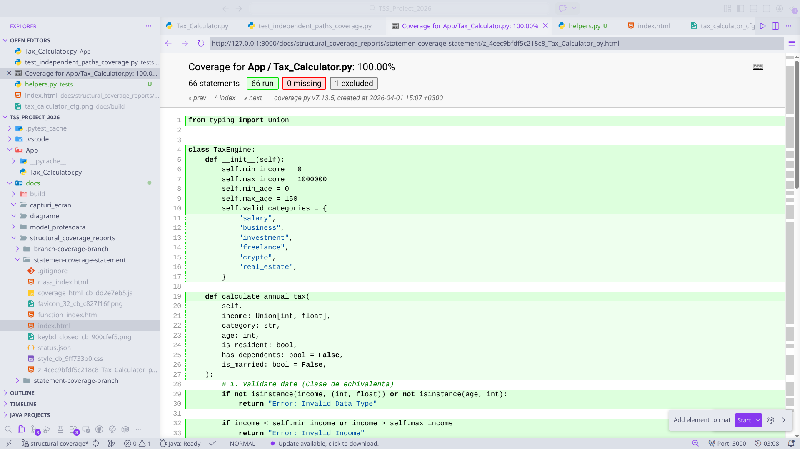
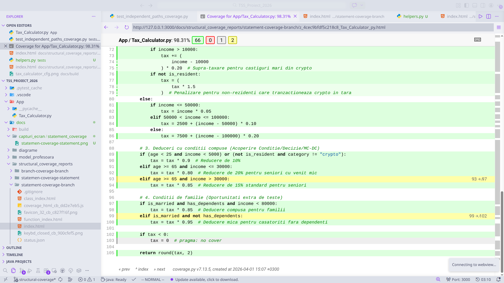
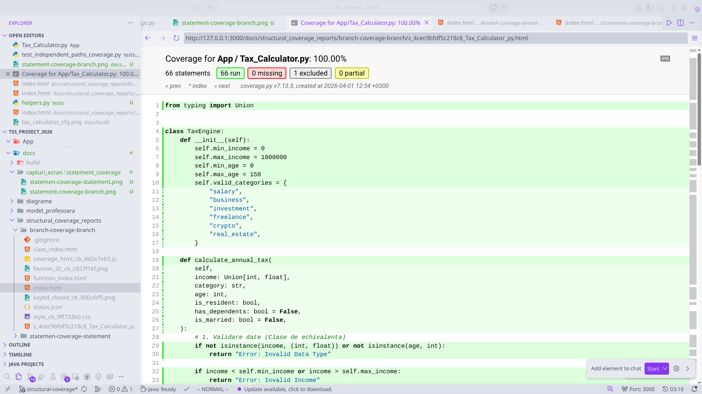

# Analiza Acoperirii Structurale (Structural Coverage Analysis)

În cadrul acestui proiect, am efectuat o analiză detaliată a acoperirii structurale pentru clasa `Tax_Calculator`. Scopul acestei analize a fost de a evalua eficiența seturilor noastre de teste în raport cu codul sursă.

## 1. Statement Coverage pe Statement Tests
Inițial, am rulat testele concepute special pentru acoperirea instrucțiunilor (statement coverage). Rezultatul a fost o acoperire de **100%** la nivel de statement, ceea ce indică faptul că fiecare linie de cod a fost executată cel puțin o dată.

## 2. Branch Coverage pe Statement Tests
Ulterior, am analizat acoperirea ramurilor (branch coverage) folosind același set de teste conceput pentru statement coverage. Rezultatul obținut a fost de **98%**. Această discrepanță subliniază faptul că, deși toate instrucțiunile sunt parcurse, nu toate deciziile logice (ramurile IF/ELSE) sunt testate în totalitate.

Acest lucru ne-a indicat clar că avem nevoie de mai multe teste specifice pentru a atinge o acoperire completă la nivel de branch.

## 3. Branch Coverage pe Branch Tests
După adăugarea testelor suplimentare pentru a acoperi toate ramificațiile logice, am rulat din nou analiza de branch coverage. De data aceasta, am obținut o acoperire de **100%** atât pe instrucțiuni, cât și pe ramuri.

## Concluzii
Analiza demonstrează că o acoperire de 100% a instrucțiunilor nu garantează testarea tuturor scenariilor logice. Tranziția de la statement coverage la branch coverage ne-a permis să identificăm cazuri marginale neacoperite și să îmbunătățim calitatea suitei de teste, asigurând robustețea aplicației `Tax_Calculator`.
