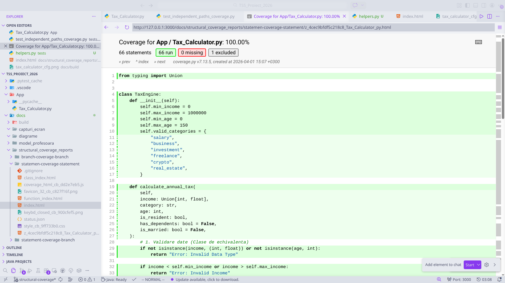
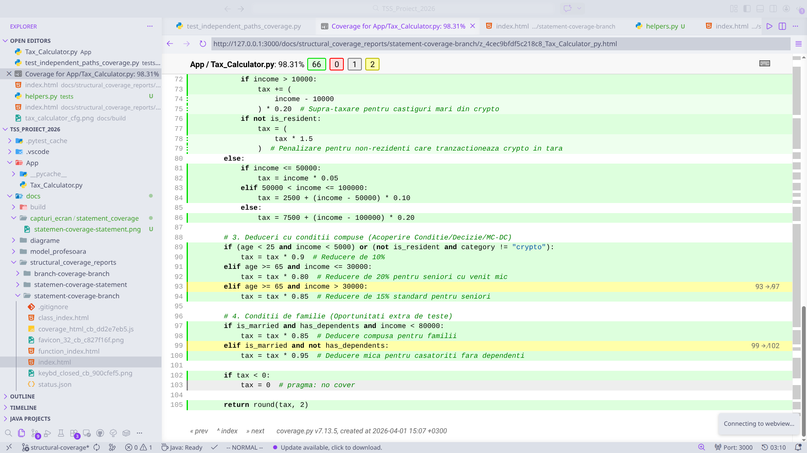
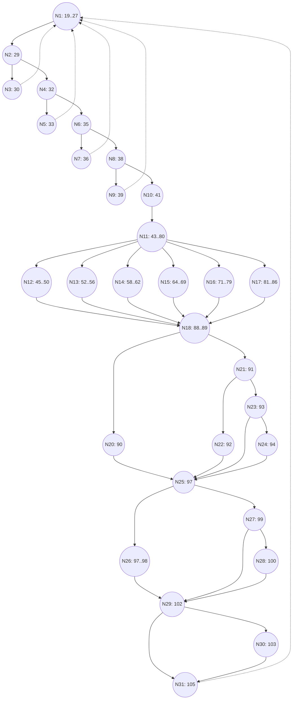

# Analiza Acoperirii Structurale (Structural Coverage Analysis)

În cadrul acestui proiect, am efectuat o analiză detaliată a acoperirii structurale pentru clasa `Tax_Calculator`. Scopul acestei analize a fost de a evalua eficiența seturilor noastre de teste în raport cu codul sursă.

## 1. Statement Coverage pe Statement Tests
Inițial, am rulat testele concepute special pentru acoperirea instrucțiunilor (statement coverage). Rezultatul a fost o acoperire de **100%** la nivel de statement, ceea ce indică faptul că fiecare linie de cod a fost executată cel puțin o dată.

## 2. Branch Coverage pe Statement Tests
Ulterior, am analizat acoperirea ramurilor (branch coverage) folosind același set de teste conceput pentru statement coverage. Rezultatul obținut a fost de **98%**. Această discrepanță subliniază faptul că, deși toate instrucțiunile sunt parcurse, nu toate deciziile logice (ramurile IF/ELSE) sunt testate în totalitate.

Acest lucru ne-a indicat clar că avem nevoie de mai multe teste specifice pentru a atinge o acoperire completă la nivel de branch.

## 3. Branch Coverage pe Branch Tests
După adăugarea testelor suplimentare pentru a acoperi toate ramificațiile logice, am rulat din nou analiza de branch coverage. De data aceasta, am obținut o acoperire de **100%** atât pe instrucțiuni, cât și pe ramuri.

## 4. Graful de Control al Fluxului (CFG)
Pentru a înțelege structura logică complexă a funcției `calculate_annual_tax`, am generat un graf de control al fluxului (Control Flow Graph). Acesta vizualizează toate căile posibile de execuție, de la validările inițiale până la returnarea rezultatului final.

```mermaid
flowchart TD
    N1(("N1: 19..27")) --> N2(("N2: 29"))
    N2 --> N3(("N3: 30"))
    N2 --> N4(("N4: 32"))

    N4 --> N5(("N5: 33"))
    N4 --> N6(("N6: 35"))

    N6 --> N7(("N7: 36"))
    N6 --> N8(("N8: 38"))

    N8 --> N9(("N9: 39"))
    N8 --> N10(("N10: 41"))

    N10 --> N11(("N11: 43..80"))

    N11 --> N12(("N12: 45..50"))
    N11 --> N13(("N13: 52..56"))
    N11 --> N14(("N14: 58..62"))
    N11 --> N15(("N15: 64..69"))
    N11 --> N16(("N16: 71..79"))
    N11 --> N17(("N17: 81..86"))

    N12 --> N18(("N18: 88..89"))
    N13 --> N18
    N14 --> N18
    N15 --> N18
    N16 --> N18
    N17 --> N18

    N18 --> N20(("N20: 90"))
    N18 --> N21(("N21: 91"))

    N20 --> N25(("N25: 97"))

    N21 --> N22(("N22: 92"))
    N21 --> N23(("N23: 93"))
    N22 --> N25

    N23 --> N24(("N24: 94"))
    N23 --> N25
    N24 --> N25

    N25 --> N26(("N26: 97..98"))
    N25 --> N27(("N27: 99"))

    N26 --> N29(("N29: 102"))

    N27 --> N28(("N28: 100"))
    N27 --> N29
    N28 --> N29

    N29 --> N30(("N30: 103"))
    N29 --> N31(("N31: 105"))
    N30 --> N31

    N3 -.-> N1
    N5 -.-> N1
    N7 -.-> N1
    N9 -.-> N1
    N31 -.-> N1
```

### Legendă Noduri 
- **N1 (19..27):** Antet funcție `calculate_annual_tax`.
- **N2 (29):** Validare tip date (`income`, `age`).
- **N3 (30):** Return eroare tip.
- **N4 (32):** Validare `income > 0`.
- **N5 (33):** Return eroare income.
- **N6 (35):** Validare `age > 0`.
- **N7 (36):** Return eroare age.
- **N8 (38):** Validare categorie validă.
- **N9 (39):** Return eroare categorie.
- **N10 (41):** Inițializare `tax = 0`.
- **N11 (43..80):** Dispatch pe categorii de venit (Salary, Business, etc.).
- **N12 - N17:** Blocuri specifice fiecărei categorii.
- **N18 (88..89):** Intrare în secțiunea de reduceri (Rezident/Non-rezident).
- **N20 - N24:** Aplicare reduceri în funcție de rezidență și vârstă (Senior).
- **N25 (97):** Intrare în secțiunea de condiții familiale.
- **N26 - N28:** Reduceri pentru căsătoriți și persoane cu dependenți.
- **N29 (102):** Verificare finală `tax < 0`.
- **N30 (103):** Normalizare taxă la 0.
- **N31 (105):** Return rezultat final.

## 5. Complexitate Ciclomatică (Cyclomatic Complexity)
Complexitatea ciclomatică (CC) este o măsură cantitativă a numărului de căi liniar independente prin codul sursă al unui program. Pentru funcția `calculate_annual_tax`, am obținut următoarele rezultate folosind instrumentul `radon`:

| Metodă | Complexitate Ciclomatică | Grad (Rank) |
| :--- | :---: | :---: |
| `TaxEngine.calculate_annual_tax` | **41** | **F** |

O complexitate de **41** este considerată foarte mare (grad F), ceea ce indică un cod cu foarte multe ramificații logice și decizii. Acest lucru justifică necesitatea unui set extins de teste pentru a asigura o acoperire completă.

## 6. Drumuri Independente (Circuite)
Bazându-ne pe graful de control al fluxului și pe complexitatea ciclomatică, am identificat drumurile independente (circuitele) prin cod. Testarea acestor drumuri asigură că am verificat toate combinațiile logice fundamentale.

Am implementat o suită de teste dedicată în `tests/structural_coverage/test_independent_paths_coverage.py`, care urmărește acoperirea acestor circuite:
- **Validări de intrare:** Căile care duc la erori de tip, income, age sau categorie (ex: `N1->N2->N3`).
- **Căi de succes pe categorii:** Fiecare categorie de venit combinată cu diferite praguri de impozitare.
- **Circuite de reduceri:** Combinații de vârstă (Senior), rezidență și condiții familiale.

Acest nivel de testare ("Basis Path Testing") ne oferă certitudinea că niciun "circuit" logic nu a rămas neverificat, chiar și în prezența unei complexități ridicate.

## Concluzii
Analiza demonstrează că o acoperire de 100% a instrucțiunilor nu garantează testarea tuturor scenariilor logice. Tranziția de la statement coverage la branch coverage ne-a permis să identificăm cazuri marginale neacoperite și să îmbunătățim calitatea suitei de teste, asigurând robustețea aplicației `Tax_Calculator`.
