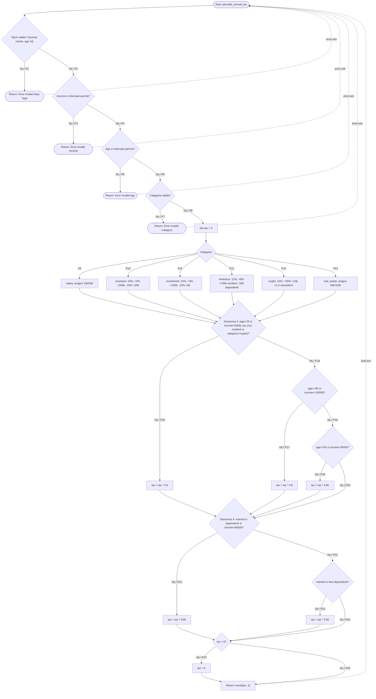

# CFG Mermaid - TaxEngine.calculate_annual_tax

## Notatii Pentru Independent Circuits

- P1-P8: validari si iesiri timpurii
- P9-P14: ramuri pe categorii fiscale
- P15-P20: ajustari sectiunea 3 (varsta, rezidenta, praguri)
- P21-P24: ajustari sectiunea 4 (stare civila si dependenti)
- P25-P26: tratament final (tax negativ vs return final)
- Muchiile punctate catre A sunt legaturi vizuale de tip dead-end, nu flux executabil normal
