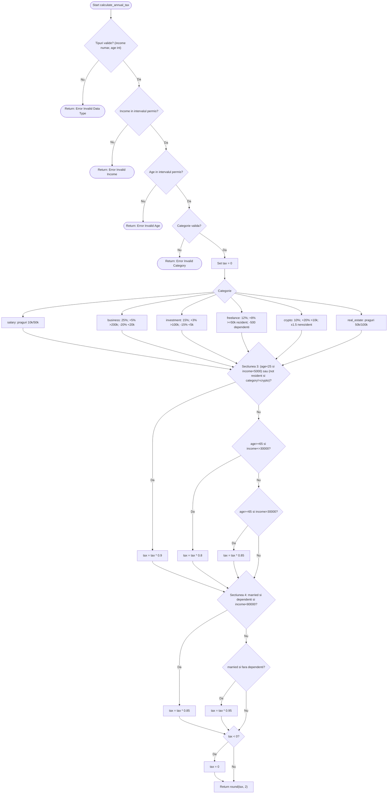

# CFG Mermaid - TaxEngine.calculate_annual_tax

```mermaid
flowchart TD
    A([Start calculate_annual_tax]) --> B{"Tipuri valide? (income numar, age int)"}
    B -- Nu --> E1([Return: Error Invalid Data Type])
    B -- Da --> C{Income in intervalul permis?}
    C -- Nu --> E2([Return: Error Invalid Income])
    C -- Da --> D{Age in intervalul permis?}
    D -- Nu --> E3([Return: Error Invalid Age])
    D -- Da --> E{Categorie valida?}
    E -- Nu --> E4([Return: Error Invalid Category])
    E -- Da --> F[Set tax = 0]

    F --> G{Categorie}
    G --> S[salary: praguri 10k/50k]
    G --> BZ[business: 25%; +5% >200k; -20% <20k]
    G --> I[investment: 15%; +3% >100k; -15% <5k]
    G --> FR[freelance: 12%; +8% >=50k rezident; -500 dependenti]
    G --> CR[crypto: 10%; +20% >10k; x1.5 nerezident]
    G --> RE[real_estate: praguri 50k/100k]
    S --> H
    BZ --> H
    I --> H
    FR --> H
    CR --> H
    RE --> H

    H{"Sectiunea 3: (age<25 si income<5000) sau (not resident si category!=crypto)?"}
    H -- Da --> H1[tax = tax * 0.9]
    H -- Nu --> H2{age>=65 si income<=30000?}
    H2 -- Da --> H3[tax = tax * 0.8]
    H2 -- Nu --> H4{age>=65 si income>30000?}
    H4 -- Da --> H5[tax = tax * 0.85]
    H4 -- Nu --> J
    H1 --> J
    H3 --> J
    H5 --> J

    J{"Sectiunea 4: married si dependenti si income<80000?"}
    J -- Da --> J1[tax = tax * 0.85]
    J -- Nu --> J2{married si fara dependenti?}
    J2 -- Da --> J3[tax = tax * 0.95]
    J2 -- Nu --> K
    J1 --> K
    J3 --> K

    K{tax < 0?}
    K -- Da --> K1[tax = 0]
    K -- Nu --> L["Return round(tax, 2)"]
    K1 --> L
```
