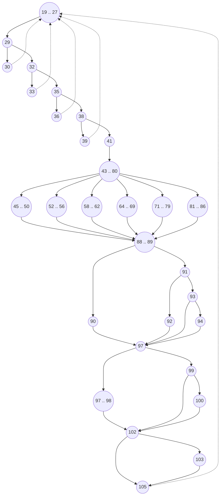

# CFG Mermaid - TaxEngine.calculate_annual_tax

```mermaid
flowchart TD
    N1(("19 .. 27")) --> N2((29))
    N2 --> N3((30))
    N2 --> N4((32))

    N4 --> N5((33))
    N4 --> N6((35))

    N6 --> N7((36))
    N6 --> N8((38))

    N8 --> N9((39))
    N8 --> N10((41))

    N10 --> N11(("43 .. 80"))

    N11 --> N12(("45 .. 50"))
    N11 --> N13(("52 .. 56"))
    N11 --> N14(("58 .. 62"))
    N11 --> N15(("64 .. 69"))
    N11 --> N16(("71 .. 79"))
    N11 --> N17(("81 .. 86"))

    N12 --> N18(("88 .. 89"))
    N13 --> N18
    N14 --> N18
    N15 --> N18
    N16 --> N18
    N17 --> N18

    N18 --> N20((90))
    N18 --> N21((91))

    N20 --> N25((97))

    N21 --> N22((92))
    N21 --> N23((93))
    N22 --> N25

    N23 --> N24((94))
    N23 --> N25
    N24 --> N25

    N25 --> N26(("97 .. 98"))
    N25 --> N27((99))

    N26 --> N29((102))

    N27 --> N28((100))
    N27 --> N29
    N28 --> N29

    N29 --> N30((103))
    N29 --> N31((105))
    N30 --> N31

    N3 -.-> N1
    N5 -.-> N1
    N7 -.-> N1
    N9 -.-> N1
    N31 -.-> N1
```

## Legenda Noduri (Stil Profesoara)

- N1 = 19..27: antet functie `calculate_annual_tax`
- N2 = 29: validare tip date
- N3 = 30: return eroare tip
- N4 = 32: validare income
- N5 = 33: return eroare income
- N6 = 35: validare age
- N7 = 36: return eroare age
- N8 = 38: validare categorie
- N9 = 39: return eroare categorie
- N10 = 41: `tax = 0`
- N11 = 43..80: dispatch pe categorie
- N12 = 45..50: bloc salary
- N13 = 52..56: bloc business
- N14 = 58..62: bloc investment
- N15 = 64..69: bloc freelance
- N16 = 71..79: bloc crypto
- N17 = 81..86: bloc real_estate
- N18 = 88..89: intrare + conditia compusa din sectiunea 3
- N20 = 90: aplicare reducere 10%
- N21 = 91: verificare senior cu income <= 30000
- N22 = 92: aplicare reducere 20%
- N23 = 93: verificare senior cu income > 30000
- N24 = 94: aplicare reducere 15%
- N25 = 97: intrare sectiunea 4 (conditie familie)
- N26 = 97..98: ramura casatorit + dependenti + income < 80000
- N27 = 99: ramura casatorit fara dependenti
- N28 = 100: aplicare reducere 5%
- N29 = 102: verificare `tax < 0`
- N30 = 103: setare `tax = 0`
- N31 = 105: return final `round(tax, 2)`
